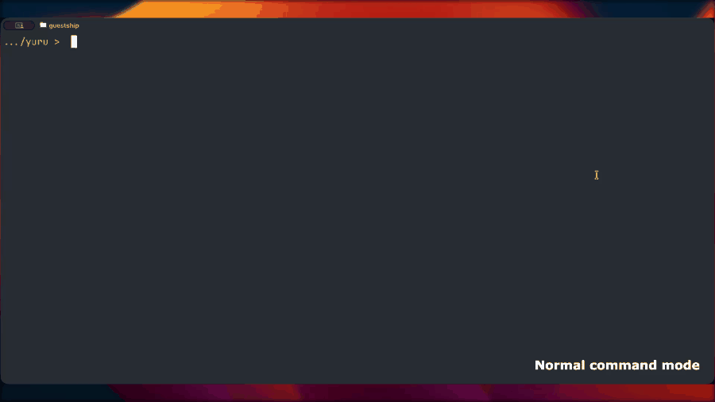

# Yuru

<p align="center">
  
</p>

[](https://github.com/Ameyanagi/yuru/actions/workflows/ci.yml)
[](https://github.com/Ameyanagi/yuru/releases/latest)
[](https://crates.io/crates/yuru)
[](https://docs.rs/yuru)
[](#license)
[](Cargo.toml)

Yuru is a fast command-line fuzzy finder with Japanese, Korean, and Chinese
phonetic search. It is designed to feel familiar to fzf users while adding
multilingual matching and source-span highlighting for CJK text.

The name comes from `ゆるい`, meaning loose or relaxed. In this project it points
to forgiving fuzzy matching: the query can be a little loose, and Yuru tries to
find the intended multilingual text.

Yuru's direction and fuzzy-finder behavior are human-led, while the coding has
been done primarily through agentic coding. The implementation, tests,
installers, shell integrations, and documentation are heavily shaped by that
agentic workflow, with the project maintainer steering the specification.

## Demo Video



[Watch the full-quality MP4 demo](demo.mp4)

## Why Yuru instead of fzf?

| Feature | fzf | Yuru |
| --- | --- | --- |
| General fuzzy finding | Yes | Yes |
| Japanese kana/kanji phonetic matching | Limited | Yes |
| Korean Hangul romanized/initial matching | Limited | Yes |
| Chinese pinyin and initials matching | Limited | Yes |
| fzf-like shell bindings | Yes | Yes |
| Full fzf option compatibility | Yes | Partial, evolving |
| CJK source-span highlighting | Limited | Yes |

Multilingual fuzzy finding has problems that are different from plain fzf-style
matching. A single visible candidate may need original text, normalized text,
Japanese kana and romaji readings, Korean Hangul romanization and choseong
initials, Chinese pinyin and initials, and source-span maps for highlighting.
Yuru keeps those as typed search keys and expands each query into a small set of
compatible variants, so a romanized query can match CJK readings without turning
every search into an unbounded cross-product.

See [architecture and optimization details](docs/internals.md) for the indexing
model, search algorithms, Big-O estimates, fzf comparison, streaming input, lazy
candidate construction, async search workers, and preview workers.

Localized documentation:

- [日本語](docs/README.ja.md)
- [中文](docs/README.zh.md)
- [한국어](docs/README.ko.md)

## Install

Yuru installs into user space by default. It does not require `sudo`.

macOS and Linux:

```sh
curl -fsSL https://raw.githubusercontent.com/Ameyanagi/yuru/v0.1.6/install | sh -s -- --all --version v0.1.6
```

This installs `yuru` into `~/.local/bin` unless `XDG_BIN_HOME` or
`YURU_INSTALL_BIN_DIR` is set. `--all` also adds shell integration for the current
shell. The installer writes user-space defaults to `~/.config/yuru/config.toml`.
Interactive installs ask for the default language; pressing Enter, or running
without an interactive prompt, uses Japanese (`ja`).
They also ask for the preview command; the default `auto` uses Yuru's built-in
preview with `bat` when available for configured text extensions. The image
preview protocol defaults to `none`, which keeps automatic detection. When shell
integration is installed, they ask which path search backend to use; the default
`auto` tries `fd`, then `fdfind`, then the portable fallback.

To choose language or key bindings explicitly without prompts:

```sh
curl -fsSL https://raw.githubusercontent.com/Ameyanagi/yuru/v0.1.6/install | sh -s -- --all --version v0.1.6 --default-lang ja --preview-command auto --preview-image-protocol none --path-backend auto --bindings ask
```

`--bindings` accepts `all`, `none`, `ask`, or a comma-separated list such as
`ctrl-t,ctrl-r,completion`. You can re-run the guided config later with
`yuru configure`.

Windows PowerShell:

```powershell
$script = Invoke-RestMethod https://raw.githubusercontent.com/Ameyanagi/yuru/v0.1.6/install.ps1
Invoke-Expression "& { $script } -All -Version v0.1.6"
```

This installs `yuru.exe` into `%LOCALAPPDATA%\Yuru\bin`, adds that directory to
the user PATH, adds PowerShell integration to your user profile, and can write
the default language and shell bindings to `%APPDATA%\yuru\config.toml`.
Interactive installs ask for the default language; use `-DefaultLang` to skip
that prompt. Use `-PreviewCommand auto|none|COMMAND`,
`-PreviewImageProtocol none|halfblocks|sixel|kitty|iterm2`, and
`-PathBackend auto|fd|fdfind|find` to set preview and shell path behavior
without prompts.

```powershell
$script = Invoke-RestMethod https://raw.githubusercontent.com/Ameyanagi/yuru/v0.1.6/install.ps1
Invoke-Expression "& { $script } -All -Version v0.1.6 -DefaultLang ja -PreviewCommand auto -PreviewImageProtocol none -PathBackend auto"
```

To install only the binary:

```sh
curl -fsSL https://raw.githubusercontent.com/Ameyanagi/yuru/v0.1.6/install | sh -s -- --version v0.1.6
```

```powershell
$script = Invoke-RestMethod https://raw.githubusercontent.com/Ameyanagi/yuru/v0.1.6/install.ps1
Invoke-Expression "& { $script } -Version v0.1.6"
```

Crates.io:

```sh
cargo install yuru
```

The crates.io package and installed command are both `yuru`.
Source builds use Lindera's embedded IPADIC dictionary for Japanese readings, so
they require a working C compiler. On macOS, install Xcode Command Line Tools;
Yuru's Cargo config and scripts prefer `/usr/bin/clang` for Apple targets.
Release binaries do not require a local compiler.

Image preview support is compiled by default through the `image` feature. To
build without image decoding/rendering dependencies:

```sh
cargo install yuru --no-default-features
```

Latest convenience install commands are also available from the `main` branch,
but release-pinned commands are recommended for reproducibility.

See [install and uninstall details](docs/install-uninstall.md), including
release checksums and exactly which files the installer can modify.

## Shell Integration

Yuru can print shell setup code directly from the binary:

```sh
eval "$(yuru --bash)"
source <(yuru --zsh)
yuru --fish | source
```

PowerShell:

```powershell
yuru --powershell | Invoke-Expression
```

The shell integration provides:

- `CTRL-T`: insert selected files or directories
- `CTRL-R`: search command history
- `ALT-C`: cd into a selected directory
- `**<TAB>`: fuzzy path completion

The bash, zsh, and fish behavior follows fzf’s documented shell integration
model. PowerShell support uses PSReadLine key handlers.

## Usage

Filter input:

```sh
printf "README.md\nsrc/lib.rs\ntests/日本語.txt\n" | yuru --lang ja --filter ni
```

Open the interactive finder:

```sh
fd --hidden --exclude .git . | yuru --scheme path
```

Interactive mode streams stdin and default commands, so large generators such as
`fd` can keep producing candidates while the UI is already open. Use `--sync` if
you want fzf-style synchronous startup.

Chinese pinyin initials:

```sh
printf "北京大学.txt\nnotes.txt\n" | yuru --lang zh --filter bjdx
```

Japanese romaji:

```sh
printf "カメラ.txt\ntests/日本人の.txt\n" | yuru --lang ja --filter kamera
```

Korean Hangul romanization, choseong initials, and 2-set keyboard input:

```sh
printf "한글.txt\nnotes.txt\n" | yuru --lang ko --filter hangeul
printf "한글.txt\nnotes.txt\n" | yuru --lang ko --filter ㅎㄱ
printf "한글.txt\nnotes.txt\n" | yuru --lang ko --filter gksrmf
```

Auto language mode keeps one backend active per run:

```sh
printf "北京大学.txt\n" | LANG=zh_CN.UTF-8 yuru --lang auto --filter bjdx
```

Explain a match:

```sh
printf "北京大学.txt\n" | yuru --lang zh --filter bjdx --explain
```

Check local setup:

```sh
yuru doctor
```

## fzf Compatibility

Yuru accepts fzf's current option surface so existing shell bindings and
`FZF_DEFAULT_OPTS` do not fail at parse time. Search/scripting options such as
`--query`, `--filter`, `--select-1`, `--exit-0`, `--print-query`, `--read0`,
`--print0`, `--nth`, `--with-nth`, `--accept-nth`, `--scheme`, `--walker`, and
`--expect` are implemented. `--bind` is partial; unsupported bind actions warn
by default:

```sh
yuru --fzf-compat warn   # default
yuru --fzf-compat strict # fail on unsupported bind actions
yuru --fzf-compat ignore # keep quiet
```

`FZF_DEFAULT_OPTS` is loaded in safe mode by default so UI-heavy fzf options do
not accidentally break Yuru:

```sh
yuru --load-fzf-default-opts never|safe|all
```

`[preview] command = "auto"` enables Yuru's built-in preview: images are
rendered internally, configured text extensions use `bat` when available and
fall back to `cat`-style plain text output. Files outside the configured
extension list also use the text path when their contents look like ASCII text.
Preview commands that emit image bytes,
or select image files directly, are rendered through the default `image` feature
with `ratatui-image`; raster images and SVG files are supported. Ghostty uses
the Kitty graphics protocol, including inside tmux when passthrough is enabled. Set
`YURU_PREVIEW_IMAGE_PROTOCOL=sixel|kitty|iterm2|halfblocks` or
`[preview] image_protocol = "kitty"` in config to force a protocol. The config
default `none` leaves automatic detection enabled.

See the full [fzf compatibility matrix](docs/fzf-compat.md).

## Configuration

Yuru reads `~/.config/yuru/config.toml` after safe fzf defaults and before
`YURU_DEFAULT_OPTS` and CLI arguments.

```toml
[defaults]
lang = "auto"          # plain | ja | ko | zh | auto
scheme = "path"        # default | path | history
case = "smart"         # smart | ignore | respect
limit = 200
load_fzf_defaults = "safe"
fzf_compat = "warn"

[preview]
command = "auto"        # auto | none | shell command
text_extensions = [
  "txt", "md", "markdown", "toml", "json", "yaml", "yml", "csv", "tsv",
  "log", "rs", "py", "js", "ts", "tsx", "sh", "ps1", "sql", "html", "css",
]
image_protocol = "none" # none | halfblocks | sixel | kitty | iterm2

[matching]
algo = "greedy"        # greedy | fzf-v1 | fzf-v2 | nucleo
max_query_variants = 8
max_search_keys_per_candidate = 8
max_total_key_bytes_per_candidate = 1024

[ja]
reading = "lindera"    # none | lindera

[ko]
romanization = true
initials = true
keyboard = true

[zh]
pinyin = true
initials = true
polyphone = "common"   # none | common

[shell]
bindings = "all"       # all | none | ctrl-t,ctrl-r,alt-c,completion
path_backend = "auto"  # auto | fd | fdfind | find
ctrl_t_command = "__yuru_compgen_path__ ."
ctrl_t_opts = "--preview-auto"
alt_c_command = "__yuru_compgen_dir__ ."
alt_c_opts = "--preview-auto"
```

See [configuration details](docs/config.md) and
[language matching behavior](docs/language-matching.md).
Matcher algorithm names are compatibility-inspired modes: `fzf-v1` uses Yuru's
greedy scorer, while `fzf-v2` and `nucleo` use the nucleo-backed quality scorer.

## Development

Install local git hooks:

```sh
./scripts/install-hooks
```

Run the quality gate:

```sh
./scripts/check
```

Run benchmarks:

```sh
./scripts/bench
YURU_BENCH_1M=1 ./scripts/bench
```

The hook policy runs formatter, linter, tests, and benchmarks before commits and
pushes. Set `YURU_SKIP_BENCH=1` only when you intentionally need a fast local
checkpoint.

Performance numbers from the current benchmark suite are published in
[docs/performance.md](docs/performance.md). Troubleshooting notes are in
[docs/troubleshooting.md](docs/troubleshooting.md).

## Releases

GitHub Actions builds release assets for:

- `x86_64-unknown-linux-gnu`
- `x86_64-apple-darwin`
- `aarch64-apple-darwin`
- `x86_64-pc-windows-msvc`

Create a version tag to publish a release and crates.io packages. The release
workflow only runs on tags, and the tag must match the crate version.

```sh
git tag v0.1.6
git push origin v0.1.6
```

Release notes are tracked in [CHANGELOG.md](CHANGELOG.md). Contributor and
security policies live in [CONTRIBUTING.md](CONTRIBUTING.md) and
[SECURITY.md](SECURITY.md).

## License

Yuru is distributed under the terms of both the MIT license and the Apache
License 2.0. See [LICENSE-MIT](LICENSE-MIT) and
[LICENSE-APACHE](LICENSE-APACHE).
