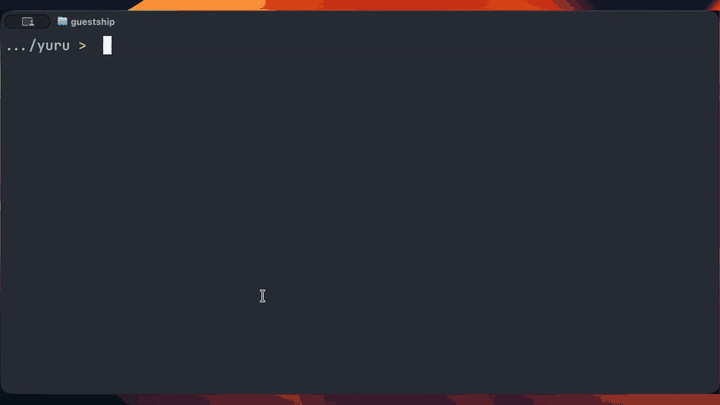

# Yuru

Yuru 是一个高速命令行 fuzzy finder，支持按日语读音、韩语 Hangul 和中文拼音搜索。
它保持接近 fzf 的使用体验，同时让 CJK 文本可以按读音匹配，并准确高亮原始文本。

## 演示视频



[观看完整质量的 Yuru 中文命令演示](../demo-zh.mp4)

<video src="../demo-zh.mp4" controls muted playsinline width="100%"></video>

## 安装

Yuru 默认安装到用户目录，不需要 `sudo`。

macOS / Linux 交互式安装:

```sh
curl -fsSL https://raw.githubusercontent.com/Ameyanagi/yuru/v0.1.8/install | sh -s -- --all --version v0.1.8
```

默认会把 `yuru` 安装到 `~/.local/bin`。可以通过 `XDG_BIN_HOME` 或
`YURU_INSTALL_BIN_DIR` 修改安装目录。在交互式终端中运行时，这个命令会询问默认语言、
预览命令、用于文本预览的扩展名、图片预览协议、shell 绑定和 shell 路径搜索后端，
然后写入 `~/.config/yuru/config.toml`。每个提示直接按 Enter 会使用该项默认值。
预览命令的默认值 `auto` 会在文本预览中优先使用 `bat`，图片则使用 Yuru 内置预览。
图片预览协议默认值是 `none`。shell 路径搜索后端默认值 `auto` 会依次尝试
`fd`、`fdfind` 和可移植的后备实现。

如果希望把中文设为默认搜索语言，并显式给出交互式安装的默认值:

```sh
curl -fsSL https://raw.githubusercontent.com/Ameyanagi/yuru/v0.1.8/install | sh -s -- --all --version v0.1.8 --default-lang zh --preview-command auto --preview-image-protocol none --path-backend auto --bindings all
```

之后可以运行 `yuru configure` 重新配置。

Windows PowerShell:

```powershell
$script = Invoke-RestMethod https://raw.githubusercontent.com/Ameyanagi/yuru/v0.1.8/install.ps1
Invoke-Expression "& { $script } -All -Version v0.1.8"
```

这会把 `yuru.exe` 安装到 `%LOCALAPPDATA%\Yuru\bin`，更新用户 PATH，并写入 PowerShell profile。
交互式环境会询问默认语言、预览命令、用于文本预览的扩展名、图片预览协议、shell 绑定和 shell 路径搜索后端。
如果希望把中文设为默认语言，可以这样显式指定:

```powershell
$script = Invoke-RestMethod https://raw.githubusercontent.com/Ameyanagi/yuru/v0.1.8/install.ps1
Invoke-Expression "& { $script } -All -Version v0.1.8 -DefaultLang zh -PreviewCommand auto -PreviewImageProtocol none -PathBackend auto -Bindings all"
```

只安装二进制文件:

```sh
curl -fsSL https://raw.githubusercontent.com/Ameyanagi/yuru/v0.1.8/install | sh -s -- --version v0.1.8
```

从 crates.io 安装:

```sh
cargo install yuru
```

crates.io 包名和安装后的命令名都是 `yuru`。
从源码构建时，Yuru 会使用 Lindera embedded IPADIC 生成日语读音，因此需要 C 编译器。
macOS 请安装 Xcode Command Line Tools；这个仓库的 Cargo config 和 scripts 会在 Apple target 上优先使用
`/usr/bin/clang`。GitHub release 提供的预编译二进制文件不需要本地编译器。

更多信息见 [install / uninstall docs](install-uninstall.md)。

## Shell 集成

```sh
eval "$(yuru --bash)"
source <(yuru --zsh)
yuru --fish | source
```

PowerShell:

```powershell
Invoke-Expression ((yuru --powershell) -join "`n")
```

可用操作:

- `CTRL-T`: 选择文件或目录并插入到命令行
- `CTRL-R`: 搜索命令历史
- `ALT-C`: 进入选择的目录
- `**<TAB>`: fuzzy path completion

## 使用示例

中文拼音首字母:

```sh
printf "北京大学.txt\nnotes.txt\n" | yuru --lang zh --filter bjdx
```

日语 romaji:

```sh
printf "カメラ.txt\ntests/日本人の.txt\n" | yuru --lang ja --filter kamera
```

韩语 Hangul romanization / 初声 / 2-set keyboard:

```sh
printf "한글.txt\nnotes.txt\n" | yuru --lang ko --filter hangeul
printf "한글.txt\nnotes.txt\n" | yuru --lang ko --filter ㅎㄱ
printf "한글.txt\nnotes.txt\n" | yuru --lang ko --filter gksrmf
```

文件搜索:

```sh
fd --hidden --exclude .git . | yuru --scheme path
```

## fzf 兼容性与配置

Yuru 可以解析 fzf 的主要选项集合，因此现有 shell 绑定和 `FZF_DEFAULT_OPTS` 不容易因为解析错误而中断。
`--filter`、`--query`、`--read0`、`--print0`、`--nth`、`--with-nth`、`--scheme`、`--walker`、`--expect` 已经实现。
`--bind` 仍是部分支持，未支持的动作默认会输出警告。

```sh
yuru --fzf-compat warn
yuru --fzf-compat strict
yuru --fzf-compat ignore
```

如果预览命令输出图片字节数据，Yuru 会通过 `ratatui-image` 渲染。需要时可用
`YURU_PREVIEW_IMAGE_PROTOCOL=sixel|kitty|iterm2|halfblocks` 固定预览协议。
图片预览由默认启用的 `image` feature 提供。如需更小的源码构建，可使用
`cargo install yuru --no-default-features`。

如果要把中文设为默认语言，可以在 `~/.config/yuru/config.toml` 中设置 `lang = "zh"`。
如果同一个候选列表需要同时支持日语、韩语和中文搜索，可以使用 `lang = "all"`。
还可以设置 `lang = "auto"`、`load_fzf_defaults = "safe"`、`algo = "greedy" | "fzf-v1" | "fzf-v2" | "nucleo"`、
`[ja] reading = "none" | "lindera"`、`[ko] initials = true`、`[zh] initials = true` 等。CLI 参数优先级最高。

详细兼容性见 [fzf compatibility](fzf-compat.md)，语言匹配行为见 [language matching](language-matching.md)。

## 开发

```sh
./scripts/install-hooks
./scripts/check
./scripts/bench
YURU_BENCH_1M=1 ./scripts/bench
```

git hook 会运行 formatter、linter、test 和 benchmark。只有在确实需要临时跳过本地 benchmark 时才使用
`YURU_SKIP_BENCH=1`。

## 发布

推送 version tag 后，GitHub Actions 会生成 macOS、Linux、Windows 的发布文件，并发布到 crates.io。
release workflow 只会在 tag push 时运行，tag 必须和 crate version 一致。

```sh
git tag v0.1.8
git push origin v0.1.8
```

## 许可证

Yuru 同时按照 MIT 许可证和 Apache License 2.0 的条款发布。请参阅
[LICENSE-MIT](../LICENSE-MIT) 和 [LICENSE-APACHE](../LICENSE-APACHE)。
